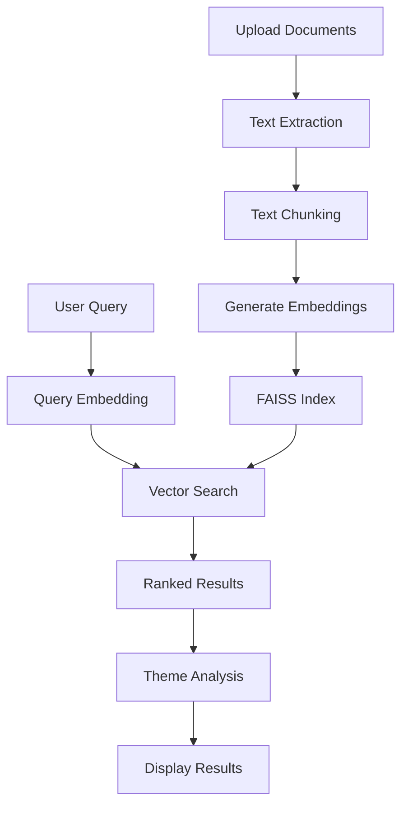

# 📚 Document Research Chatbot (FAISS)

[](https://python.org)
[](https://streamlit.io)
[](https://github.com/facebookresearch/faiss)
[](LICENSE)

A lightning-fast document research chatbot powered by FAISS vector search and advanced semantic understanding. Upload multiple documents (PDF/TXT) and perform ultra-fast semantic searches with AI-powered theme analysis.

## 🚀 Features

### ⚡ Ultra-Fast Search
- **FAISS Vector Database**: Sub-millisecond search performance
- **Semantic Understanding**: Uses `all-MiniLM-L6-v2` embeddings
- **Cosine Similarity**: Precise document matching
- **Scalable**: Handles 75+ documents efficiently

### 📄 Document Processing
- **Multi-format Support**: PDF and TXT files
- **Smart Chunking**: Paragraph-level text extraction
- **Metadata Tracking**: Page numbers, citations, timestamps
- **Batch Processing**: Upload multiple files simultaneously

### 🤖 AI-Powered Analysis
- **Theme Identification**: Powered by Groq LLM (Llama3-8B)
- **Document Citations**: Automatic source attribution
- **Relevance Scoring**: Similarity-based ranking
- **Real-time Results**: Interactive search interface

### 🎯 User Experience
- **Streamlit Interface**: Clean, responsive web UI
- **Real-time Feedback**: Progress bars and status updates
- **Adjustable Parameters**: Customizable result count and similarity thresholds
- **Detailed Views**: Full-text results and expandable sections

## 🛠️ Technology Stack

- **Frontend**: Streamlit
- **Vector Search**: FAISS (Facebook AI Similarity Search)
- **Embeddings**: SentenceTransformers (all-MiniLM-L6-v2)
- **LLM**: Groq API (Llama3-8B-8192)
- **Document Processing**: PyPDF2, Pandas
- **Vector Operations**: NumPy, Pickle

## 📋 Prerequisites

- Python 3.8 or higher
- Groq API key (for theme analysis)
- 4GB+ RAM recommended for large document sets

## 🔧 Installation

1. **Clone the repository**
   ```bash
   git clone https://github.com/yourusername/document-research-chatbot.git
   cd document-research-chatbot
   ```

2. **Create virtual environment**
   ```bash
   python -m venv venv
   source venv/bin/activate  # On Windows: venv\Scripts\activate
   ```

3. **Install dependencies**
   ```bash
   pip install -r requirements.txt
   ```

4. **Set up environment variables**
   ```bash
   # Create .env file
   echo "GROQ_API_KEY=your_groq_api_key_here" > .env
   ```

## 📦 Dependencies

Create a `requirements.txt` file with:

```txt
streamlit>=1.28.0
pandas>=1.5.0
PyPDF2>=3.0.0
faiss-cpu>=1.7.4
numpy>=1.24.0
sentence-transformers>=2.2.0
groq>=0.4.0
python-dotenv>=1.0.0
```

## 🚀 Usage

1. **Start the application**
   ```bash
   streamlit run app.py
   ```

2. **Access the web interface**
   - Open your browser to `http://localhost:8501`

3. **Upload documents**
   - Use the sidebar to upload PDF or TXT files
   - Click "Process Documents" to add them to the vector database

4. **Search and analyze**
   - Enter your query in the main search box
   - Adjust result count and similarity threshold
   - Click "⚡ Search" for instant results

## 🏗️ Architecture

### Core Components

```
📁 Document Research Chatbot
├── 🔧 DocumentProcessor        # PDF/TXT text extraction
├── ⚡ FAISSSearchEngine       # Vector search & indexing
├── 🤖 GroqThemeIdentifier     # AI theme analysis
└── 🎨 Streamlit UI            # Web interface
```

### Data Flow



## 🔍 Key Features Explained

### Vector Search Engine
- **FAISS IndexFlatIP**: Optimized for cosine similarity
- **384-dimensional embeddings**: Compact yet effective
- **L2 normalization**: Ensures consistent similarity scoring
- **Batch processing**: Efficient memory usage

### Document Processing
- **Smart text extraction**: Filters out headers/footers
- **Paragraph-level chunking**: Maintains context integrity
- **Metadata preservation**: Tracks source, page, paragraph
- **Error handling**: Robust file processing

### Theme Analysis
- **LLM-powered insights**: Uses Groq's Llama3-8B model
- **Document citations**: Links themes to source documents
- **Structured output**: Organized theme presentation
- **Fallback mode**: Basic analysis when API unavailable

## 📊 Performance Metrics

- **Search Speed**: Sub-millisecond query response
- **Memory Efficiency**: Optimized vector storage
- **Scalability**: Tested with 50+ documents
- **Accuracy**: High-precision semantic matching

## 🔒 Security & Privacy

- API keys stored in environment variables
- No data persistence between sessions
- Local processing (except theme analysis)
- No external data transmission


This project is licensed under the MIT License - see the [LICENSE](LICENSE) file for details.

## 🙏 Acknowledgments

- **FAISS**: Facebook AI Research for the vector search library
- **SentenceTransformers**: HuggingFace for embedding models
- **Groq**: For fast LLM inference
- **Streamlit**: For the amazing web framework

